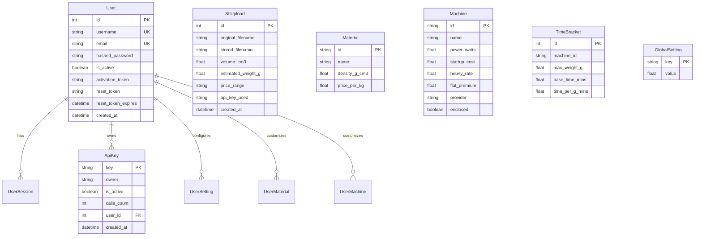

# AI Agents & Developer Fast-Track Guide (AGENTS.md)

This file is the single source of truth for AI agents (Gemini, Claude, Cursor, Copilot, ChatGPT) and developers to understand the architecture, data models, API contracts, and rapidly locate the exact files and functions to edit.

---

## 1. Project Overview & Tech Stack

The **Replica Cost Estimator** is a production-grade 3D printing cost estimation platform built for **Replica 3D Fabrication**. It parses STL mesh geometry, calculates exact volume/surface area, estimates print times, and computes real-time manufacturing and selling costs.

- **Backend**: Python 3.9+ with **FastAPI**, **Uvicorn**, **SQLAlchemy** (ORM), and **Pydantic**.
- **3D Geometry & Math Engine**: **Trimesh**, **NumPy**, **SciPy** for STL parsing, volume integration, watertight validation, and convex hull fallbacks.
- **Database**: **SQLite** (local default) and **PostgreSQL / Supabase** (production ready via `DATABASE_URL`).
- **Frontend**: Vanilla **HTML5**, **CSS3** (Custom Properties / Design Tokens), **JavaScript** (ES6+), **Three.js** (3D WebGL previewer with orbit controls), and **FontAwesome**.
- **Auth & Security**: PBKDF2-SHA256 password hashing (native `hashlib`), bearer session tokens, API keys (`X-API-Key` / `api_key`), Super Admin passcode sessions, and in-memory IP rate limiting.
- **Email Service**: **Resend REST API** for account activation and password reset emails.
- **Deployment**: **Vercel** (`pyproject.toml` with `[tool.vercel]`), **Railway / Heroku** (`Procfile`), and standalone runner (`run.py`).

---

## 2. Codebase Map & File Responsibilities

```
stl-estimator/
├── backend/
│   ├── database.py       # SQLAlchemy ORM models, DB connection pooling, auto-migrations & schema seeding
│   ├── estimator.py      # Core math: STL mesh parsing (Trimesh), public bounds formula, precise slicer costing
│   └── main.py           # FastAPI entrypoint, middleware, authentication, rate limiting, and all API routes
├── frontend/
│   ├── app.js            # Frontend state, API integration, DOM rendering, Three.js 3D viewport, modals
│   ├── index.html        # Single-page app layout: Public Widget, Developer Portal, Admin Dashboard, 3D Canvas
│   ├── reset-password.html # Standalone password reset page
│   ├── style.css         # Modern dark glassmorphism design system & responsive UI rules
│   └── icon/             # Application icons & brand assets
├── pyproject.toml        # Vercel entrypoint configuration & Python packaging
├── requirements.txt      # Python dependencies list
├── Procfile              # Railway / Heroku process manager command
├── run.py                # Local automated bootstrapper & virtualenv manager
├── migrate_db.py         # Standalone SQLite schema migration helper
├── overview.md           # High-level architecture and developer guide
├── ARCHITECTURE.md       # Deep technical architecture, data flows, and costing algorithms
└── AGENTS.md             # This agent cheatsheet
```

---

## 3. "Where to Edit" Fast Reference

### Task 1: Change Pricing Formula or Math
- **Public Min/Max Range Calculation**: [`backend/estimator.py`](file:///c:/Users/MSI/Documents/stl-estimator/backend/estimator.py) -> `calculate_public_estimate()`
  - Modifies: Material cost, machine power wattage, electricity rate, machine cost (startup_cost + hourly_rate * time), wear & tear, margin %, tax %, support buffer %, and min/max offset multipliers.
- **Precise Slicer / Admin Cost Calculation**: [`backend/estimator.py`](file:///c:/Users/MSI/Documents/stl-estimator/backend/estimator.py) -> `calculate_admin_cost()`
  - Modifies: Direct material/power costs, machine operational cost (startup_cost + hourly_rate * time), wear & tear, labor setup costs, 3D CAD modeling or 3D scanning preparation rates, subtotal, and tax amount. Margin is pure profit.

### Task 2: Change 3D Mesh Parsing or Support New 3D Formats
- **Mesh Parsing & Volume Extraction**: [`backend/estimator.py`](file:///c:/Users/MSI/Documents/stl-estimator/backend/estimator.py) -> `parse_stl_volume()`
  - Uses `trimesh.load(io.BytesIO(file_bytes), file_type='stl')`.
  - Fallback logic for non-watertight models uses `mesh.convex_hull.volume`.
- **Allowed File Extensions & Validation**: [`backend/main.py`](file:///c:/Users/MSI/Documents/stl-estimator/backend/main.py) -> `scan_stl_file()`, `public_estimate()`, `developer_estimate_stl()`

### Task 3: Add / Modify Database Models or Fields
- **ORM Table Definitions**: [`backend/database.py`](file:///c:/Users/MSI/Documents/stl-estimator/backend/database.py)
  - `User`, `UserSession`, `ApiKey`, `StlUpload`, `Material`, `Machine`, `GlobalSetting`, `TimeBracket`, `UserSetting`, `UserMaterial`, `UserMachine`, `AdminSession`.
- **Database Migrations & Seeding**: [`backend/database.py`](file:///c:/Users/MSI/Documents/stl-estimator/backend/database.py) -> `seed_database()`
  - Handles automatic `ALTER TABLE` column additions on startup.

### Task 4: Modify Rate Limiting or Upload Restrictions
- **Anonymous Upload Cooldown & IP Throttling**: [`backend/main.py`](file:///c:/Users/MSI/Documents/stl-estimator/backend/main.py) -> `scan_stl_file()` & `public_estimate()`
  - Uses `upload_tracker` in-memory dictionary.
  - Reads `upload_limit_count` (default: 5) and `upload_cooldown_seconds` (default: 60s) from `GlobalSetting`.

### Task 5: Add or Modify API Endpoints
- **API Router & Handlers**: [`backend/main.py`](file:///c:/Users/MSI/Documents/stl-estimator/backend/main.py)
  - Public routes: `/api/estimate/scan`, `/api/estimate/public`, `/api/settings`
  - Developer auth: `/api/auth/register`, `/api/auth/login`, `/api/auth/activate`, `/api/auth/forgot-password`, `/api/auth/reset-password`
  - Developer portal: `/api/developer/keys`, `/api/developer/settings`, `/api/developer/estimate-stl`, `/api/developer/uploads`
  - Super Admin: `/api/admin/auth`, `/api/admin/users*`, `/api/admin/keys*`, `/api/admin/uploads*`

### Task 6: Modify Email Notifications & Verification Links
- **Resend Email Integration**: [`backend/main.py`](file:///c:/Users/MSI/Documents/stl-estimator/backend/main.py) -> `send_resend_email()`
  - Uses `RESEND_API_KEY` environment variable.
  - HTML templates for email verification (`/api/auth/register`) and password reset (`/api/auth/forgot-password`).

### Task 7: Modify Frontend UI & Layout
- **HTML Structure & Modals**: [`frontend/index.html`](file:///c:/Users/MSI/Documents/stl-estimator/frontend/index.html)
  - Public Estimator widget: `<section id="public-tab">`
  - Developer Portal & Dashboard: `<section id="developer-tab">`
  - Super Admin Dashboard: `<section id="superadmin-tab">`
- **JavaScript UI Logic & State**: [`frontend/app.js`](file:///c:/Users/MSI/Documents/stl-estimator/frontend/app.js)
  - Tab switching: `setupNavigation()`
  - Public estimation & file drop: `setupPublicEstimator()`
  - Precise Slicer calculator: `setupAdminCalculator()`
  - Developer portal state & tables: `setupDeveloperPortal()`
  - Super Admin management: `setupSuperAdminPortal()`

### Task 8: Modify 3D Three.js STL Preview
- **3D Canvas & WebGL Rendering**: [`frontend/app.js`](file:///c:/Users/MSI/Documents/stl-estimator/frontend/app.js) -> `initThreeJS()`, `loadSTLModel()`, `resizeThreeJS()`
  - Configures ambient light, directional lights, STLLoader, mesh material, camera orbit controls, and auto-rotation.

### Task 9: Modify Colors, Theme, or Responsive Styling
- **CSS Design Tokens & Theme Variables**: [`frontend/style.css`](file:///c:/Users/MSI/Documents/stl-estimator/frontend/style.css)
  - Root variables: `--bg-primary`, `--bg-card`, `--accent-primary`, `--accent-secondary`, `--text-primary`, `--border-color`.

### Task 10: Modify Deployment & Entrypoints
- **Vercel Entrypoint**: [`pyproject.toml`](file:///c:/Users/MSI/Documents/stl-estimator/pyproject.toml) -> `[tool.vercel] entrypoint = "backend.main:app"`
- **Railway / Heroku Procfile**: [`Procfile`](file:///c:/Users/MSI/Documents/stl-estimator/Procfile) -> `web: uvicorn backend.main:app --host 0.0.0.0 --port $PORT`
- **Dependencies**: [`requirements.txt`](file:///c:/Users/MSI/Documents/stl-estimator/requirements.txt)

---

## 4. API Endpoints Reference

| Method | Endpoint | Auth Required | Description |
|---|---|---|---|
| `POST` | `/api/estimate/scan` | None | Parse STL file bytes, return volume ($cm^3$), surface area, watertight flag. |
| `POST` | `/api/estimate/public` | None / API Key | Full public cost estimation for an uploaded STL file with material and infill. |
| `POST` | `/api/estimate/admin` | Session / API Key | Precise calculation from sliced weight, time, labor hours, and preparation type. |
| `GET` | `/api/settings` | None | Fetch all global materials, machines, settings, and time brackets. |
| `PUT` | `/api/settings` | Admin Token | Update global settings, materials, and machines. |
| `POST` | `/api/auth/register` | None | Create developer account and trigger verification email. |
| `GET` | `/api/auth/activate` | Token Query | Activate account from email link. |
| `POST` | `/api/auth/login` | None | Authenticate developer and return bearer session token. |
| `POST` | `/api/auth/forgot-password` | None | Request password reset token via email. |
| `POST` | `/api/auth/reset-password` | None | Apply new password using reset token. |
| `POST` | `/api/auth/logout` | Bearer Token | Invalidate developer session. |
| `GET` | `/api/developer/keys` | Bearer Token | List API keys belonging to logged-in developer. |
| `POST` | `/api/developer/keys` | Bearer Token | Generate new developer API key (`rep_dev_...`). |
| `DELETE` | `/api/developer/keys/{key}` | Bearer Token | Delete developer API key. |
| `GET` | `/api/developer/settings` | Bearer Token | Get developer-specific pricing parameters and machines. |
| `PUT` | `/api/developer/settings` | Bearer Token | Save developer custom settings, materials, and machines. |
| `POST` | `/api/developer/estimate-stl` | Bearer / API Key | Auto-estimate print weight & time for an STL file with custom user settings. |
| `GET` | `/api/developer/uploads` | Bearer Token | List all STL uploads executed with developer's API keys. |
| `POST` | `/api/admin/auth` | Super Admin Passcode | Authenticate super admin and return 4-hour admin session token. |
| `GET` | `/api/admin/users` | Admin Token | List all registered developer accounts and statistics. |
| `DELETE` | `/api/admin/users/{id}` | Admin Token | Delete a developer account. |
| `POST` | `/api/admin/users/{id}/reset-password` | Admin Token | Manually reset a developer password. |
| `GET` | `/api/admin/keys` | Admin Token | List all platform API keys across all users. |
| `POST` | `/api/admin/keys` | Admin Token | Generate platform global API key (`rep_live_...`). |
| `PUT` | `/api/admin/keys/{key}/toggle` | Admin Token | Enable or disable an API key. |
| `DELETE` | `/api/admin/keys/{key}` | Admin Token | Delete an API key. |
| `GET` | `/api/admin/uploads` | Admin Token | Fetch complete upload log across the entire platform. |
| `GET` | `/api/admin/uploads/{id}/download` | Admin Token | Download uploaded STL file from server disk. |
| `POST` | `/api/admin/uploads/bulk-delete` | Admin Token | Bulk delete STL files and records. |

---

## 5. Database Schema Reference



---

## 6. Environment Variables

| Variable | Default | Purpose |
|---|---|---|
| `DATABASE_URL` | `sqlite:///replica_estimator_v4.db` | Database connection string (Postgres/Supabase/SQLite). |
| `ADMIN_PASSCODE` | `Hey1994Ba25` | Passcode required to unlock Super Admin portal. |
| `RESEND_API_KEY` | `None` | API key for transactional emails (activation & password reset). |
| `RESEND_FROM_EMAIL` | `no-reply@api.replica.tn` | Sender address for transactional emails. |
| `UPLOAD_DIR` | `uploads` (or `/tmp/uploads` on serverless) | Directory for storing uploaded STL files. |

---

## 7. Critical Rules for Modifying the Codebase

1. **Maintain Dual Architecture (Public vs Developer Overrides)**: Always ensure `calculate_public_estimate` and `calculate_admin_cost` check for `user_id`. When `user_id` is present, fetch user-specific materials, machines, and settings (`UserMaterial`, `UserMachine`, `UserSetting`); otherwise, fall back to global models (`Material`, `Machine`, `GlobalSetting`).
2. **Serverless Filesystem Resilience**: Never assume the local disk is writable. On Vercel / AWS Lambda, write transient data to `UPLOAD_DIR` (which falls back to `/tmp/uploads`). Catch file write exceptions gracefully.
3. **Database URL Normalization**: SQLAlchemy expects `postgresql://` instead of legacy `postgres://`. Keep the automatic prefix normalization in `backend/database.py`.
4. **Preserve Password Security**: Use constant-time comparison `secrets.compare_digest` in `verify_password` and PBKDF2-HMAC with salt.
5. **Entrypoint Integrity**: Do not remove `[tool.vercel] entrypoint = "backend.main:app"` from `pyproject.toml` or `backend.main:app` in `Procfile`.
