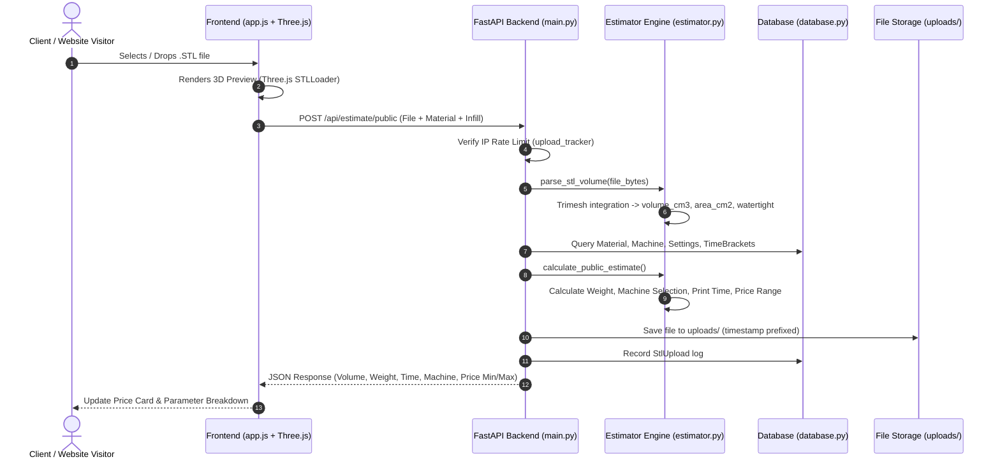

# Replica Cost Estimator - Technical Architecture & Costing Specification

This document provides in-depth technical documentation on the calculation algorithms, data flows, and infrastructure architecture of the **Replica Cost Estimator**.

---

## 1. System Flow & Data Pipelines

### 1.1 Public STL Estimation Pipeline



---

## 2. Mathematical Costing Engine

### 2.1 Public Instant Estimate Algorithm
The public estimation algorithm determines a realistic price range given an arbitrary STL geometry:

1. **Volume to Net Weight Calculation**:
   $$\text{Base Weight (g)} = \text{Volume (cm}^3\text{)} \times \text{Material Density (g/cm}^3\text{)} \times \left(\frac{\text{Infill \%}}{100}\right)$$

2. **Support Structure Weight Addition**:
   $$\text{Estimated Weight (g)} = \text{Base Weight} \times (1.0 + \text{Support Buffer \%})$$

3. **Machine Auto-Selection**:
   - If the selected material is not standard (requires heated chamber / enclosure like ABS/Nylon), select an **Enclosed Printer**.
   - Otherwise, select a standard open-frame printer.

4. **Time Estimation Bracket Lookup**:
   - Matches the machine's configured `TimeBracket` where $\text{max\_weight} \ge \text{Estimated Weight}$.
   - Interpolates estimated time:
     $$\text{Time (mins)} = \text{Base Time (mins)} + (\text{Time per Gram (mins/g)} \times \text{Estimated Weight})$$

5. **Direct Costs**:
   $$\text{Material Cost} = \left(\frac{\text{Estimated Weight}}{1000}\right) \times \text{Price per kg}$$
   $$\text{Electricity Cost} = \left(\frac{\text{Power (W)}}{1000}\right) \times \left(\frac{\text{Time (mins)}}{60}\right) \times \text{Electricity Rate (TND/kWh)}$$
   $$\text{Direct Cost} = \text{Material Cost} + \text{Electricity Cost}$$

6. **Overhead & Selling Price**:
   $$\text{Wear \& Tear} = \text{Direct Cost} \times \text{Wear Tear \%}$$
   $$\text{Subtotal} = \text{Direct Cost} + \text{Wear \& Tear}$$
   $$\text{Selling Price (HT)} = \text{Subtotal} \times (1.0 + \text{Margin \%}) + \text{Machine Flat Premium}$$
   $$\text{Base Price (TTC)} = \text{Selling Price (HT)} \times (1.0 + \text{Tax \%})$$
   $$\text{Price (Base)} = \max(\text{Base Price}, \text{Minimum Price Cap})$$

7. **Confidence Bounds**:
   $$\text{Price Min} = \max(\text{Minimum Price Cap}, \text{round}(\text{Price (Base)} \times \text{Min Offset Multiplier}))$$
   $$\text{Price Max} = \max(\text{Minimum Price Cap} + 5, \text{round}(\text{Price (Base)} \times \text{Max Offset Multiplier}))$$

---

### 2.2 Slicer / Admin Precise Costing Algorithm
For internal shop management or developer precision mode, the exact metrics from slicing software (Bambu Studio, Cura, PrusaSlicer) are used:

$$\text{Direct Cost} = \left(\frac{\text{Weight (g)}}{1000} \times \text{Material Price/kg}\right) + \left(\frac{\text{Machine Watts}}{1000} \times \frac{\text{Time (mins)}}{60} \times \text{Electricity Rate}\right)$$
$$\text{Wear \& Tear} = \text{Direct Cost} \times \text{Wear Tear \%}$$
$$\text{Labor Cost} = \text{Post-Processing Labor Hours} \times \text{Labor Rate/hr}$$
$$\text{Prep Cost} = \begin{cases} 
\text{Prep Hours} \times \text{CAD Modeling Rate/hr} & \text{if prep is Modeling} \\
\text{Prep Hours} \times \text{3D Scanning Rate/hr} & \text{if prep is Scanning} \\
0 & \text{otherwise}
\end{cases}$$
$$\text{Subtotal} = \text{Direct Cost} + \text{Wear \& Tear} + \text{Labor Cost} + \text{Prep Cost}$$
$$\text{Selling Price (HT)} = \text{Subtotal} \times (1.0 + \text{Margin \%}) + \text{Machine Flat Premium}$$
$$\text{Tax Amount} = \text{Selling Price (HT)} \times \left(\frac{\text{Tax \%}}{100}\right)$$
$$\text{Selling Price (TTC)} = \text{Selling Price (HT)} + \text{Tax Amount}$$

---

## 3. Multi-Tenancy Architecture

The platform supports a dual-tier customization model:

1. **Anonymous / Public Mode**: Uses global platform settings, materials, and machines managed by the Super Admin.
2. **Developer / Tenant Mode**: Authenticated users access their private workspace with custom parameters (`UserSetting`, `UserMaterial`, `UserMachine`) and dedicated API Keys (`ApiKey`). When requests arrive with a developer API key, calculations automatically use their custom parameters.

---

## 4. Deployment Architectures

### 4.1 Vercel (Serverless)
- Configured via `pyproject.toml` with `[tool.vercel] entrypoint = "backend.main:app"`.
- Static files served directly via FastAPI mount.
- Safe storage paths fall back to `/tmp/uploads` for transient operations.

### 4.2 Railway / Heroku (Container / Persistent VM)
- Configured via `Procfile`:
  ```
  web: uvicorn backend.main:app --host 0.0.0.0 --port $PORT
  ```
- Uses persistent storage for SQLite (`replica_estimator_v4.db`) and `uploads/` directory, or connects to external PostgreSQL via `DATABASE_URL`.
